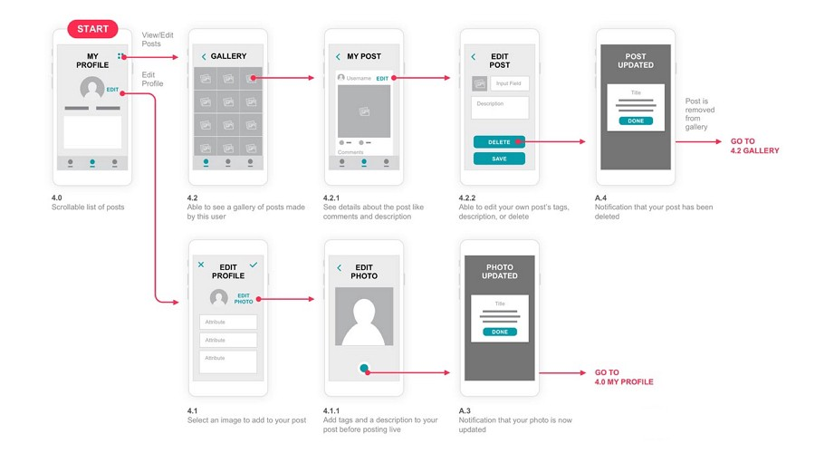
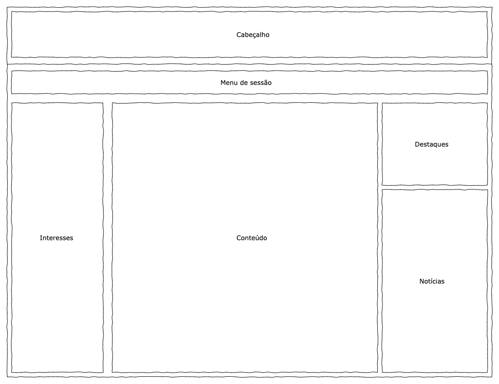

# Projeto de Interface

Uma das muitas responsabilidades do projeto é a modelagem da interface do sistema, focando na flexibilidade, usabilidade e agilidade, não deixando de lado a acessibilidade durante a navegação. Mantendo assim uma identidade visual padronizada durante toda a jornada do usuário, dividindo as entregas responsividade para uso web desktop e web mobile "acessível em navegadores pelo computador ou celulares".

## User Flow

Fluxo de usuário (User Flow) é uma técnica que permite ao desenvolvedor mapear todo fluxo de telas do site ou app. Essa técnica funciona para alinhar os caminhos e as possíveis ações que o usuário pode fazer junto com os membros de sua equipe.

> **Links Úteis**:
> - [User Flow: O Quê É e Como Fazer?](https://medium.com/7bits/fluxo-de-usu%C3%A1rio-user-flow-o-que-%C3%A9-como-fazer-79d965872534)
> - [User Flow vs Site Maps](http://designr.com.br/sitemap-e-user-flow-quais-as-diferencas-e-quando-usar-cada-um/)
> - [Top 25 User Flow Tools & Templates for Smooth](https://www.mockplus.com/blog/post/user-flow-tools)

## Wireframes

Como demonstrado no tópico de fluxo de usuário (User Flow), as telas seguem um padrão trocando apenas seu conteúdo central, destaques e notícias conforme interesse cadastrado. O sistema web se divide em um dentro de um esquema básico comum apresentado na figura abaixo. Demonstrando assim os elementos que são:

* **Cabeçalho -** local onde são dispostos elementos fixos da identidade do sistema (Logo).
* **Menu de sessão -** local que contém o menu de sessão responsavel pela troca do conteúdo central e tópicos de navegação.
* **Interesses -** local que contém link's para parceiros de cursos, treinamentos. 
* **Conteúdo -** local que contém a parte dinamica de informação e formularios do sistema.
* **Destaque -** local que contém iténs de alta relevancia.
* **Notícias -** local que contém notícias importantes sobre o mercado de trabalho.

