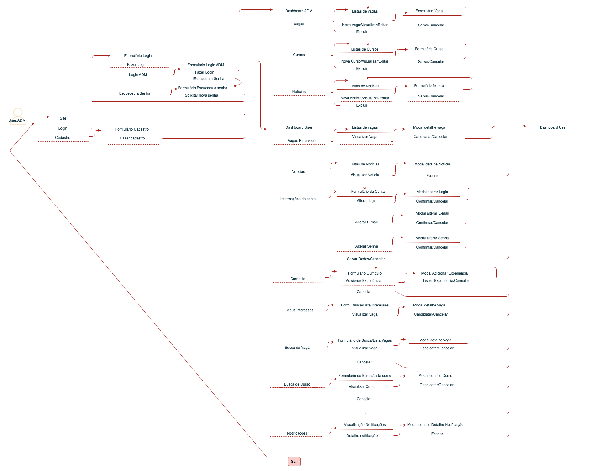
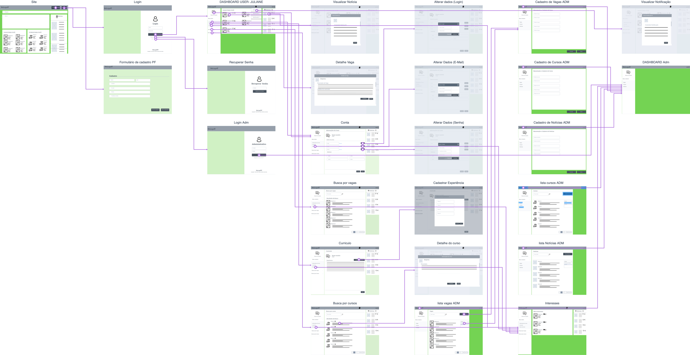

# Projeto de Interface

Uma das muitas responsabilidades do projeto é a modelagem da interface do sistema, focando na flexibilidade, usabilidade e agilidade, não deixando de lado a acessibilidade durante a navegação. Mantendo assim uma identidade visual padronizada durante toda a jornada do usuário, dividindo as entregas responsividade para uso web desktop e web mobile "acessível em navegadores pelo computador ou celulares".

## Fluxo do Usuário & Administrador

### Diagrama

## Wireframes

Como demonstrado no tópico de fluxo de usuário (User Flow), as telas seguem um padrão trocando apenas seu conteúdo central, destaques e notícias conforme interesse cadastrado. O sistema web se divide em um dentro de um esquema básico comum apresentado na figura abaixo. Demonstrando assim os elementos que são:

* **Cabeçalho -** local onde são dispostos elementos fixos da identidade do sistema (Logo), cadastro e login.
* **Pesquisar -** local onde pode se perquisar por conteúdo disponibilizado no sistema.
* **Vagas para você -** local onde é listadas as possíveis vagas aderente com o perfil. 
* **Cursos para você -** local que contém link's para parceiros de cursos, treinamentos. 
* **Notícias -** local que contém notícias importantes sobre o mercado de trabalho.
* **Banner -** local que contém a informações e notícias rápidas no formato de banner.

### Telas do sitema

O sistema conta com um projeto de wireframe on-line para que os usuários acompanhem as evolutivas, novas telas e até mesmo troca de layout conforme demandas. Podendo ser acessível [clicando aqui](https://marvelapp.com/prototype/bf6b8cj/screen/91364550).

### Mapa de fluxo

