# Programação de Funcionalidades

# Entrega 3 

## Requisto CRUD de Banner - Administrator
### Henrique Nogueira do Prado 
### Tela administrativa dos banners
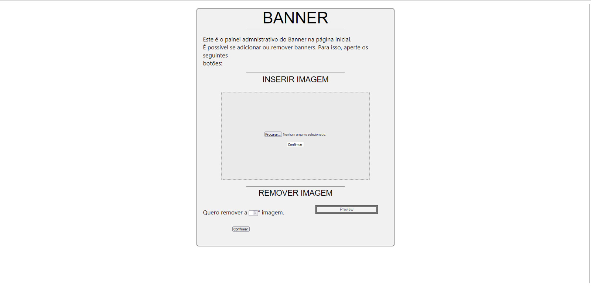
> **Links do código**:
> - [src/administrador/banner](https://github.com/ICEI-PUC-Minas-PMV-ADS/pmv-ads-2023-1-e1-proj-web-t5-nolayoff/tree/dev/src/administrador/banner)

## Requisto CRUD de Notícias - Administrator
### Juliane Rodrigues Ferreira
### Tela administrativa das notícias
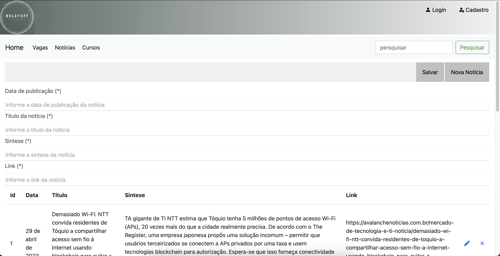
> **Links do código**:
> - [src/administrador/noticias](https://github.com/ICEI-PUC-Minas-PMV-ADS/pmv-ads-2023-1-e1-proj-web-t5-nolayoff/tree/dev/src/administrador/noticias)

## Requisto CRUD de Vagas - Administrator
### Rafael Cassiano Januário de Souza
### Tela administrativa das vagas
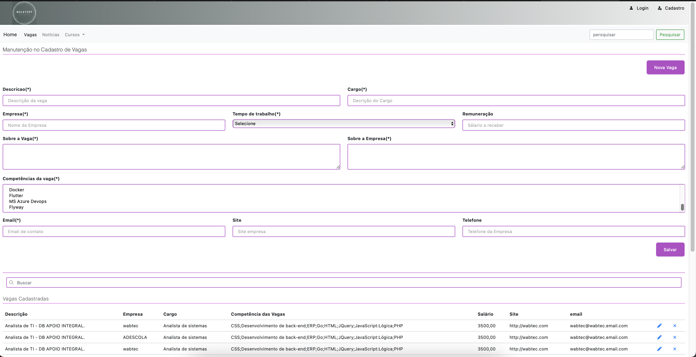
> **Links do código**:
> - [src/administrador/vagas](https://github.com/ICEI-PUC-Minas-PMV-ADS/pmv-ads-2023-1-e1-proj-web-t5-nolayoff/tree/dev/src/administrador/vagas)

## Requisto CRUD de Cursos - Administrator
### Rafael Cassiano Januário de Souza
### Tela administrativa dos cursos
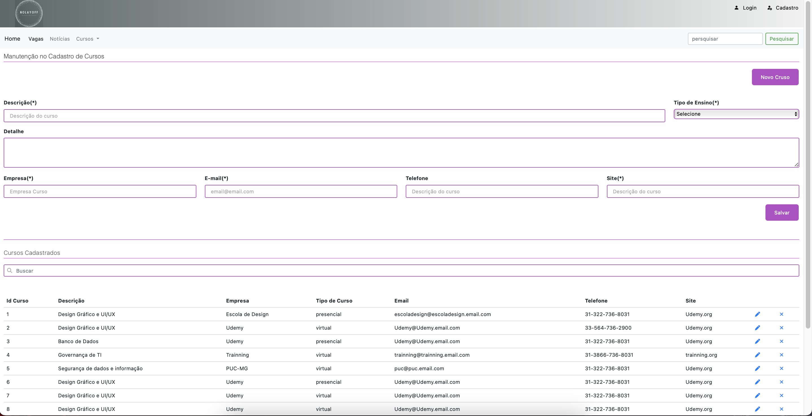
> **Links do código**:
> - [src/administrador/cursos](https://github.com/ICEI-PUC-Minas-PMV-ADS/pmv-ads-2023-1-e1-proj-web-t5-nolayoff/tree/dev/src/administrador/cursos)

## Requisto CRUD de Curriculum - Usuário
### Tuerê Pinto
### Tela de atualizacão curricular
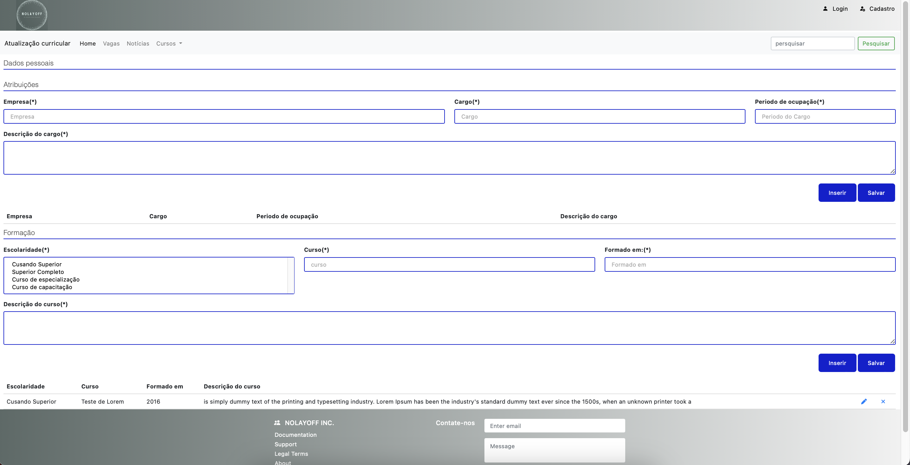
> **Links do código**:
> - [src/usuarios/curriculo](https://github.com/ICEI-PUC-Minas-PMV-ADS/pmv-ads-2023-1-e1-proj-web-t5-nolayoff/tree/dev/src/usuarios/curriculo)

---

# Entrega 4
## Requisto CRUD de IMAGEM DE PERFIL DO USUARIO - Usuário
### Henrique Nogueira do Prado 
### Tela de perfil do usuário
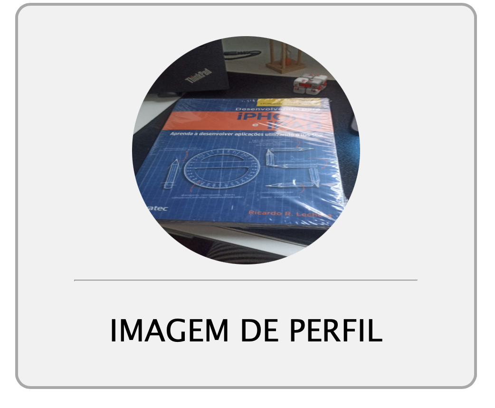
> **Links do código**:
> - [src/usuarios/imagem_de_perfil](https://github.com/ICEI-PUC-Minas-PMV-ADS/pmv-ads-2023-1-e1-proj-web-t5-nolayoff/tree/crud-imagensdeperfil/src/usuarios/imagem_de_perfil)

## Requisto FUNÇÃO PESQUISAR - Site
### Henrique Nogueira do Prado 
### Tela com campo pesquisa
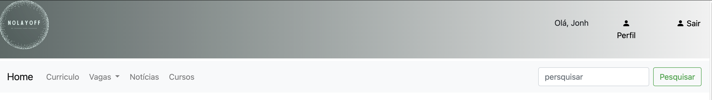
> **Links do código**:
> - [src/usuarios/pesquisa/javascript/pesquisa.js](https://github.com/ICEI-PUC-Minas-PMV-ADS/pmv-ads-2023-1-e1-proj-web-t5-nolayoff/blob/crud-imagensdeperfil/src/usuarios/pesquisa/javascript/pesquisa.js)

## Requisto CRUD de Interesses - Usuário
### Juliane Rodrigues Ferreira
### Tela com interesses favoritados
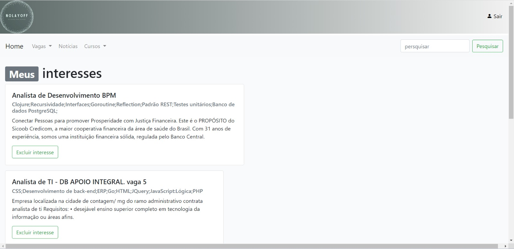
> **Links do código**:
> - [src/usuarios/interesses](https://github.com/ICEI-PUC-Minas-PMV-ADS/pmv-ads-2023-1-e1-proj-web-t5-nolayoff/tree/dev/src/usuarios/interesses)

## Requisto Integração exibição de VAGAS, INTERESSES, CURSOS, NOTÍCIAS nas telas de HOME tratando o perfil de usuário - Site
### Rafael Cassiano Januário de Souza
### Tela administrativa das vagas
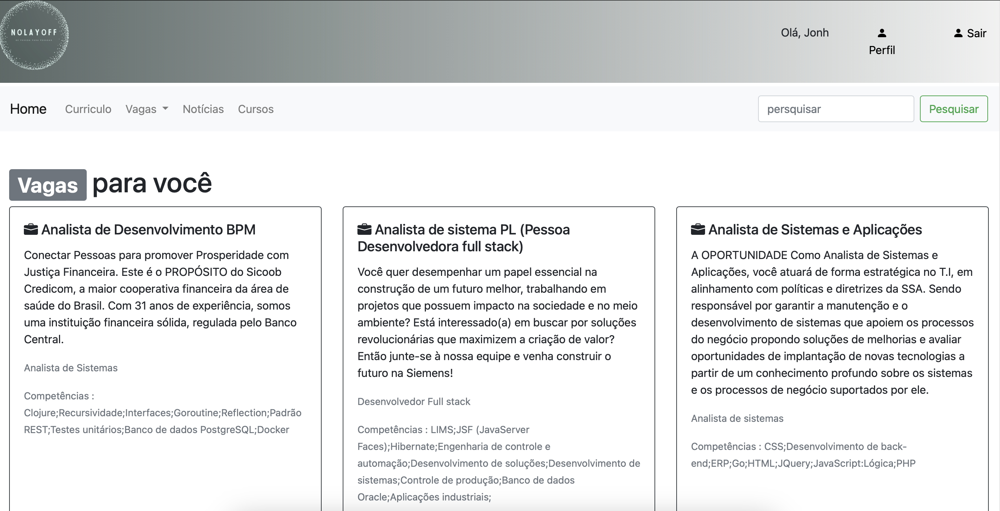
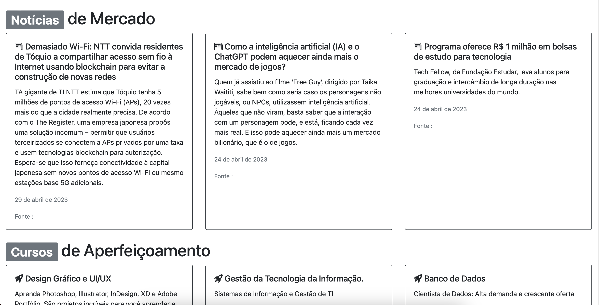
> **Links do código**:
> - [src/usuarios/index_usuario.html](https://github.com/ICEI-PUC-Minas-PMV-ADS/pmv-ads-2023-1-e1-proj-web-t5-nolayoff/blob/dev/src/usuarios/index_usuario.html)
> - [index.html](https://github.com/ICEI-PUC-Minas-PMV-ADS/pmv-ads-2023-1-e1-proj-web-t5-nolayoff/blob/dev/index.html)

## Requisto Cadastro de Perfil do Usuário Admim e Comum - Site
### Tuerê Pinto
### Tela de atualizacão curricular
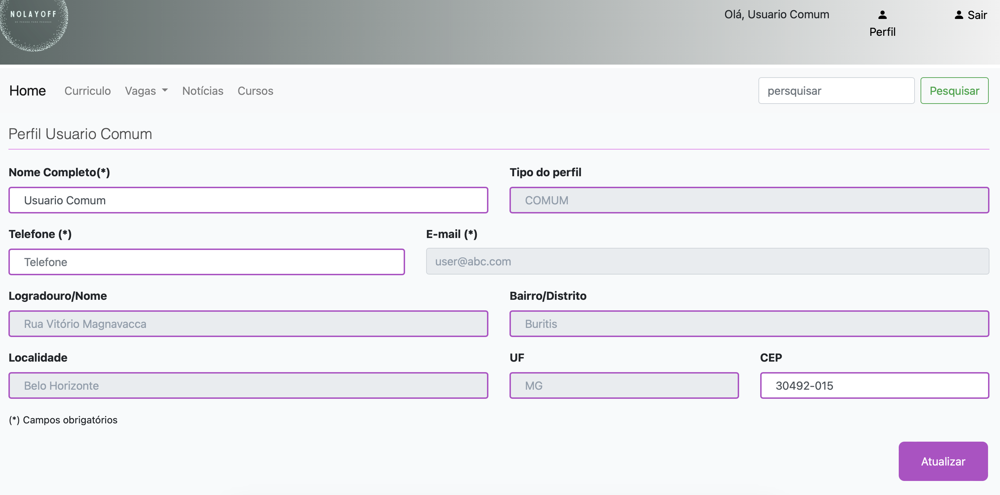
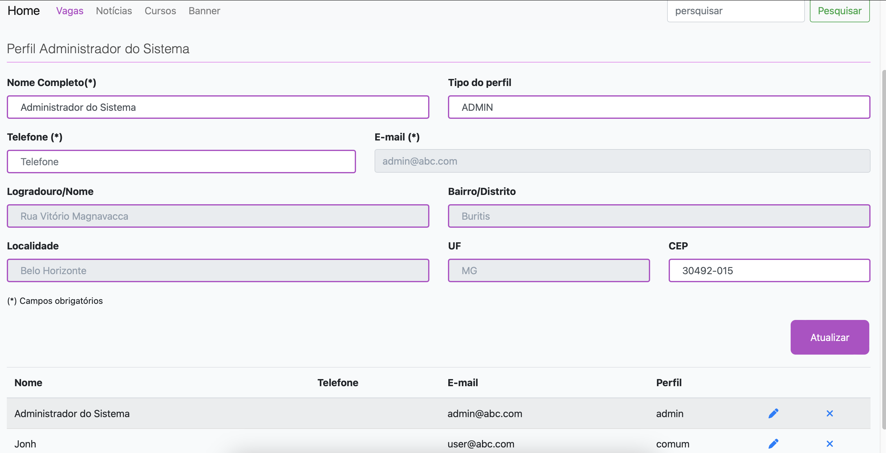
> **Links do código**:
> - [src/home](https://github.com/ICEI-PUC-Minas-PMV-ADS/pmv-ads-2023-1-e1-proj-web-t5-nolayoff/tree/dev/src/home)