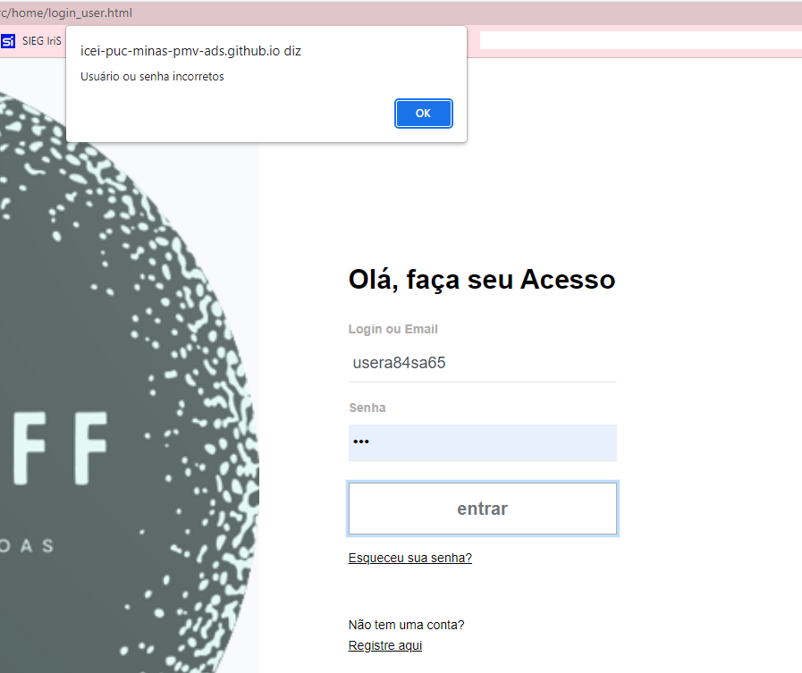
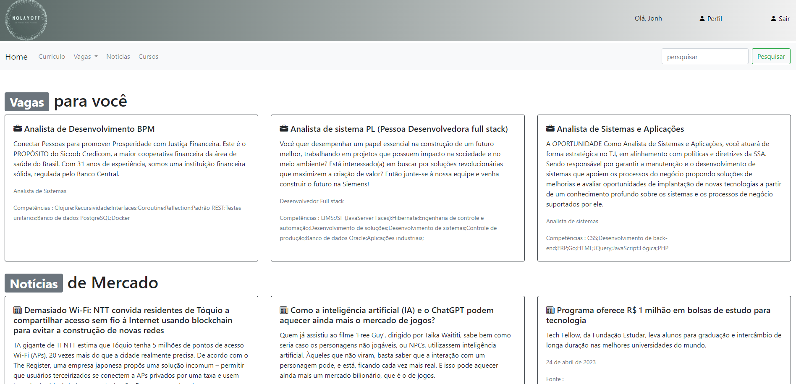

# Registro de Testes de Software

## Caso de Testes 1

**Objetivo:** Teste de login do usuário.

**Teste da funcão:** Login do usuário

**Cenário de teste:** Nome de usuário e senha informados o login deve ter o comportamento de susesso ou erro. No caso de erro exibir uma mensagem para o usuário.

**Comportamento do sistema no caso de sucesso:** Entrar na página de inico destinada ao tipo de usuário.

**Mensagem de susesso:** 

**Comportamento do sistema no caso de erro:** Não deixar entrar na página de inico destinada ao tipo de usuário.

**Mensagem de erro:** Usuário ou senha incorretos

## Resultado dos teste

**Teste:**
Sucesso.

**Descrição:**
Ao acessar com login e senha corretos, o usuário é direcionado para a pagina principal.
Caso o usuario ou a senha sejam digitados incorretamente, uma mensagem de alerta aparecerá.

**Evidência:**

**Correção:**
Sem correções a serem feitas.

---

## Caso de Testes 2

**Objetivo:** Teste de login do usuário por perfil.

**Teste da funcão:** Login do usuário Administrador ou Comum

**Cenário de teste 1:** Nome de usuário e senha informados com perfil COMUM no acesso não administrativo deve ter o comportamento de enviar para a tela inicial da jornada, caso seja usando os dados de acesso na sessão do administrador não deve deixar efetuar o login. 

**Cenário de teste 2:** Nome de usuário e senha informados com perfil ADMINISTRADOR no acesso administrativo deve ter o comportamento de enviar para a tela inicial da jornada, caso seja usando os dados de acesso na sessão não administrativa não deve deixar efetuar o login. 

**Comportamento do sistema no caso de sucesso:** Entrar na página de inico destinada ao tipo de usuário.

**Mensagem de susesso:** 

**Comportamento do sistema no caso de erro:** Não deixar entrar na página de inico destinada ao tipo de usuário.

**Mensagem de erro:** Usuário ou senha incorretos

## Resultado dos teste - <TESTER>

**Descrição:**

**Evidência:**

**Correção:**

---

## Caso de Testes 3

**Objetivo:** Teste CRUD de Notícias.

**Teste da funcão:** Cadastrar notícias, atualizar, exibir para os usuários comum as notícias, para o administrador a possibilidade de deletar.

**Cenário de teste 1:** Usuário com perfil COMUM no acesso não administrativo deve pode visualizar as notícias cadastradas.

**Cenário de teste 2:** Usuário com perfil ADMINISTRADOR no acesso administrativo deve poder inserir, atualizar e deletar notícias. 

**Comportamento do sistema no caso de sucesso:** Exibir em lista as notícias cadastradas ou atualizadas.

**Mensagem de susesso:** 

**Comportamento do sistema no caso de sucesso:** Deve deixar deletar uma ou mais de uma notícia cadastrada.

**Mensagem de sucesso:** 

## Resultado dos teste - <TESTER>

**Descrição:**

**Evidência:**

**Correção:**

---

## Caso de Testes 4

**Objetivo:** Teste CRUD de CURSOS.

**Teste da funcão:** Cadastrar cursos, atualizar, exibir para os usuários comum as notícias, para o administrador a possibilidade de deletar.

**Cenário de teste 1:** Usuário com perfil COMUM no acesso não administrativo deve pode visualizar as cursos cadastradas conforme de perfil do usuário.

**Cenário de teste 2:** Usuário com perfil ADMINISTRADOR no acesso administrativo deve poder inserir, atualizar e deletar os cursos. 

**Comportamento do sistema no caso de sucesso:** Exibir em lista as cursos cadastradas ou atualizadas.

**Mensagem de susesso:** 

**Comportamento do sistema no caso de sucesso:** Deve deixar deletar uma ou mais de um cursos cadastrada.

**Mensagem de sucesso:** 

## Resultado dos teste - <TESTER>

**Descrição:**

**Evidência:**

**Correção:**

---

## Caso de Testes 5

**Objetivo:** Teste CRUD de VAGAS.

**Teste da funcão:** Cadastrar vagas, atualizar, exibir para os usuários comum as vagas, para o administrador a possibilidade de deletar.

**Cenário de teste 1:** Usuário com perfil COMUM no acesso não administrativo deve pode visualizar as vagas cadastradas conforme de perfil do usuário.

**Cenário de teste 2:** Usuário com perfil ADMINISTRADOR no acesso administrativo deve poder inserir, atualizar e deletar os vagas. 

**Comportamento do sistema no caso de sucesso:** Exibir em lista as vagas cadastradas ou atualizadas.

**Mensagem de susesso:** 

**Comportamento do sistema no caso de sucesso:** Deve deixar deletar uma ou mais de uma vagas cadastrada.

**Mensagem de sucesso:** 

## Resultado dos teste - <TESTER>

**Teste:**
Sucesso parcial.

**Descrição:**
Cenário de teste 1: As vagas disponíveis não estão visíveis para o usuário comum.

Cenário de teste 2: O usuário administrador consegue cadastrar e editar vagas, porém não consegue excluir as vagas ja cadastradas. Ao clicar no botão de excluir aparece a mensagem "vaga removida com sucesso", mas ela continua visível no painel.

**Evidência:**
Cenário de teste 1:

Cenário de teste 2:

**Correção:**
Cenário 1: As vagas cadastradas no usuário administrador devem estar expostas no perfil do usuário comum.

Cenário 2: No usuário administrador o botão excluir deve ser verificado, o mesmo não está efetuando a ação de excluir vagas.

---

## Caso de Testes 6

**Objetivo:** Teste CRUD de BANNER.

**Teste da funcão:** Cadastrar banner, atualizar, exibir para os usuários comum os banner, para o administrador a possibilidade de deletar.

**Cenário de teste 1:** Usuário logados ou não no sitema podem visualizar os banner cadastradas na pagina inicial.

**Cenário de teste 2:** Usuário com perfil ADMINISTRADOR no acesso administrativo deve poder inserir, atualizar e deletar os banner. 

**Comportamento do sistema no caso de sucesso:** Exibir em lista as banner cadastradas ou atualizadas.

**Mensagem de susesso:** 

**Comportamento do sistema no caso de sucesso:** Deve deixar deletar uma ou mais de um banner cadastrada.

**Mensagem de sucesso:** 

## Resultado dos teste - <TESTER>

**Descrição:**

**Evidência:**

**Correção:**

---

## Caso de Testes 7

**Objetivo:** Teste CRUD de INTERESSES.

**Teste da funcão:** Cadastrar interesses, atualizar, exibir e deletar.

**Cenário de teste 1:** **Cenário de teste 1:** Usuário com perfil COMUM no acesso não administrativo deve pode visualizar e favoritas e deletar os interesses cadastradas.

**Cenário de teste 2:** 

**Comportamento do sistema no caso de sucesso:** Exibir em lista de interesses cadastradas ou atualizadas.

**Mensagem de susesso:** 

**Comportamento do sistema no caso de erro:**

**Mensagem de erro:** 

## Resultado dos teste - <TESTER>

**Descrição:**

**Evidência:**

**Correção:**

---

## Caso de Testes 8

**Objetivo:** Teste CRUD de CURRICULO.

**Teste da funcão:** Cadastrar curriculo, atualizar, exibir e deletar.

**Cenário de teste 1:** Usuário logados no sitema podem visualizar o curriculo cadastrado na pagina de perfil.

**Comportamento do sistema no caso de sucesso:** Exibir o curriculo cadastrado ou atualizar.

**Mensagem de susesso:** 

**Comportamento do sistema no caso de sucesso:** Deve deixar deletar o curriculo cadastrado.

**Mensagem de sucesso:** 

## Resultado dos teste - <TESTER>

**Descrição:**

**Evidência:**

**Correção:**
