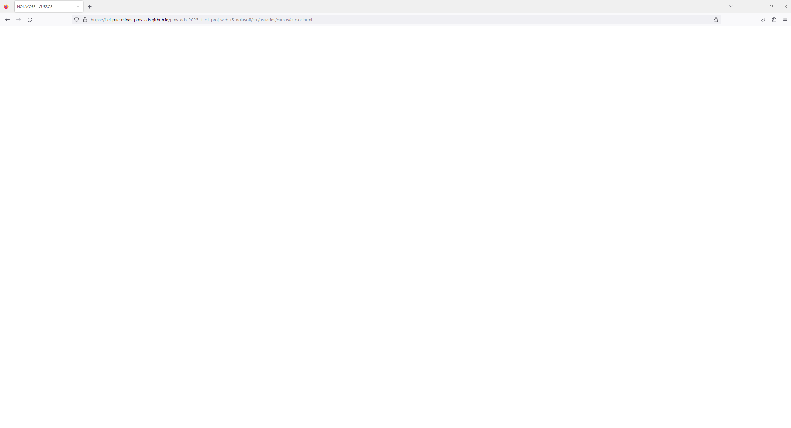
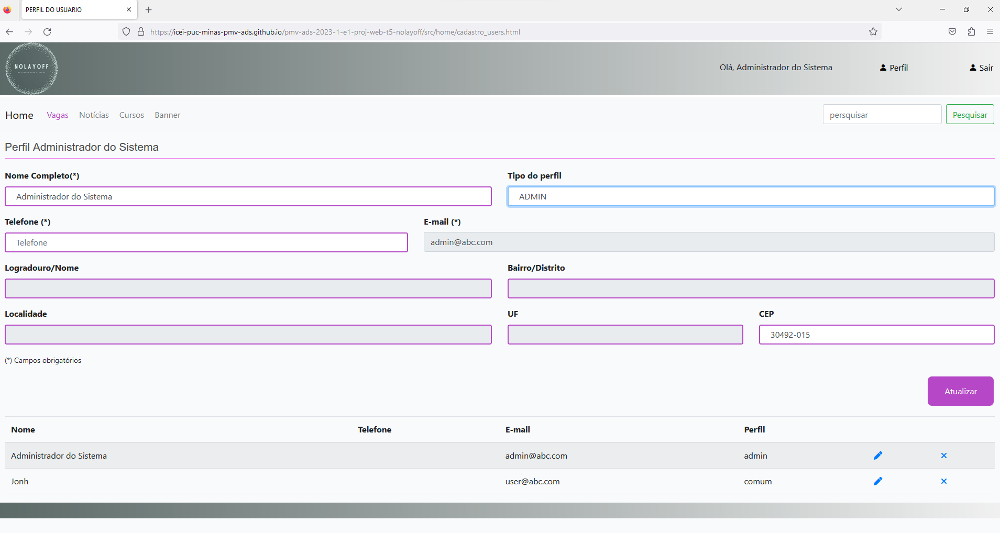

# Registro de Testes de Software

## Caso de Testes 1

**Objetivo:** Teste de login do usuário.

**Teste da funcão:** Login do usuário

**Cenário de teste 1:** Nome de usuário e senha informados o login deve ter o comportamento de susesso ou erro. No caso de erro exibir uma mensagem para o usuário.

**Cenário de teste 2:** O usuário deve conseguir deslogar de sua conta ao clicar no botão "sair".

**Comportamento do sistema no caso de sucesso:** Entrar na página de inico destinada ao tipo de usuário.

**Mensagem de susesso:** 

**Comportamento do sistema no caso de erro:** Não deixar entrar na página de inico destinada ao tipo de usuário.

**Mensagem de erro:** Usuário ou senha incorretos

## Resultado dos teste

**Teste:**
Sucesso parcial.

**Descrição:**
Ao acessar com login e senha corretos, o usuário é direcionado para a pagina principal.
Caso o usuario ou a senha sejam digitados incorretamente, uma mensagem de alerta aparecerá.
Ao deslogar o usuário é direcionado para uma página aleatória que não faz parte do projeto em questão.

**Evidência:** Cenário de teste 1:

 

 

Cenário de teste 2:

**Correção:**
Cenário de teste 2: O botão "sair", ao ser clicado, deve direcionar o usuário para a pagina inicial.

---

## Caso de Testes 2

**Objetivo:** Teste de login do usuário por perfil.

**Teste da funcão:** Login do usuário Administrador ou Comum

**Cenário de teste 1:** Nome de usuário e senha informados com perfil COMUM no acesso não administrativo deve ter o comportamento de enviar para a tela inicial da jornada, caso seja usando os dados de acesso na sessão do administrador não deve deixar efetuar o login. 

**Cenário de teste 2:** Nome de usuário e senha informados com perfil ADMINISTRADOR no acesso administrativo deve ter o comportamento de enviar para a tela inicial da jornada, caso seja usando os dados de acesso na sessão não administrativa não deve deixar efetuar o login. 

**Comportamento do sistema no caso de sucesso:** Entrar na página de inico destinada ao tipo de usuário.

**Mensagem de susesso:** 

**Comportamento do sistema no caso de erro:** Não deixar entrar na página de inico destinada ao tipo de usuário.

**Mensagem de erro:** Usuário ou senha incorretos

## Resultado dos teste - <TESTER>

**Descrição:**

**Evidência:**

**Correção:**

---

## Caso de Testes 3

**Objetivo:** Teste CRUD de Notícias.

**Teste da funcão:** Cadastrar notícias, atualizar, exibir para os usuários comum as notícias, para o administrador a possibilidade de deletar.

**Cenário de teste 1:** Usuário com perfil COMUM no acesso não administrativo deve pode visualizar as notícias cadastradas.

**Cenário de teste 2:** Usuário com perfil ADMINISTRADOR no acesso administrativo deve poder inserir, atualizar e deletar notícias. 

**Comportamento do sistema no caso de sucesso:** Exibir em lista as notícias cadastradas ou atualizadas.

**Mensagem de susesso:** 

**Comportamento do sistema no caso de sucesso:** Deve deixar deletar uma ou mais de uma notícia cadastrada.

**Mensagem de sucesso:** 

## Resultado dos teste - <TESTER>

**Descrição:**

**Evidência:**

**Correção:**

---

## Caso de Testes 4

**Objetivo:** Teste CRUD de CURSOS.

**Teste da funcão:** Cadastrar cursos, atualizar, exibir para os usuários comum as notícias, para o administrador a possibilidade de deletar.

**Cenário de teste 1:** Usuário com perfil COMUM no acesso não administrativo deve pode visualizar as cursos cadastradas conforme de perfil do usuário.

**Cenário de teste 2:** Usuário com perfil ADMINISTRADOR no acesso administrativo deve poder inserir, atualizar e deletar os cursos. 

**Comportamento do sistema no caso de sucesso:** Exibir em lista as cursos cadastradas ou atualizadas.

**Mensagem de susesso:** 

**Comportamento do sistema no caso de sucesso:** Deve deixar deletar uma ou mais de um cursos cadastrada.

**Mensagem de sucesso:** 

## Resultado dos teste - <TESTER>

**Teste:**
Sucesso parcial.

**Descrição:**

Cenário de teste 1: Os cursos disponíveis não estão visíveis para o usuário comum.

Cenário de teste 2: O usuário administrador consegue inserir, atualizar e deletar cursos.

**Evidência:**

Cenário de teste 1:

Cenário de teste 2:

**Correção:**
Cenário 1: Os cursos cadastrados no usuário administrador devem estar expostos no perfil do usuário comum.

---

## Caso de Testes 5

**Objetivo:** Teste CRUD de VAGAS.

**Teste da funcão:** Cadastrar vagas, atualizar, exibir para os usuários comum as vagas, para o administrador a possibilidade de deletar.

**Cenário de teste 1:** Usuário com perfil COMUM no acesso não administrativo deve pode visualizar as vagas cadastradas conforme de perfil do usuário.

**Cenário de teste 2:** Usuário com perfil ADMINISTRADOR no acesso administrativo deve poder inserir, atualizar e deletar os vagas. 

**Comportamento do sistema no caso de sucesso:** Exibir em lista as vagas cadastradas ou atualizadas.

**Mensagem de susesso:** 

**Comportamento do sistema no caso de sucesso:** Deve deixar deletar uma ou mais de uma vagas cadastrada.

**Mensagem de sucesso:** 

## Resultado dos teste - <TESTER>

**Teste:**
Sucesso parcial.

**Descrição:**
Cenário de teste 1: As vagas disponíveis não estão visíveis para o usuário comum.

Cenário de teste 2: O usuário administrador consegue cadastrar e editar vagas, porém não consegue excluir as vagas ja cadastradas. Ao clicar no botão de excluir aparece a mensagem "vaga removida com sucesso", mas ela continua visível no painel.

**Evidência:**
Cenário de teste 1:

Cenário de teste 2:

**Correção:**
Cenário 1: As vagas cadastradas no usuário administrador devem estar expostas no perfil do usuário comum.

Cenário 2: No usuário administrador o botão excluir deve ser verificado, o mesmo não está efetuando a ação de excluir vagas.

---

## Caso de Testes 6

**Objetivo:** Teste CRUD de BANNER.

**Teste da funcão:** Cadastrar banner, atualizar, exibir para os usuários comum os banner, para o administrador a possibilidade de deletar.

**Cenário de teste 1:** Usuário logados ou não no sitema podem visualizar os banner cadastradas na pagina inicial.

**Cenário de teste 2:** Usuário com perfil ADMINISTRADOR no acesso administrativo deve poder inserir, atualizar e deletar os banner. 

**Comportamento do sistema no caso de sucesso:** Exibir em lista as banner cadastradas ou atualizadas.

**Mensagem de susesso:** 

**Comportamento do sistema no caso de sucesso:** Deve deixar deletar uma ou mais de um banner cadastrada.

**Mensagem de sucesso:** 

## Resultado dos teste - <TESTER>

**Teste:**
Sucesso parcial.

**Descrição:**
Cenário 1: Usuários não logados conseguem vizualizar banners, usuários logados não tem vizualização de banners. 

Cenário 2: O CRUD não tem aplicabilidade para o administrador, não é possivel efetuar cadastros de banners e nem deleta-los.

**Evidência:**
Cenário 1:

Usuário sem estar logado -

Usuário logado-

Cenário 2:

CRUD (Área do adminitrador) - 

**Correção:**
Cenário 2: O código que possibilita o administrador cadastrar e deletar banners precisa ser todo revisado e corrigido, possibilitando que tais funcionalidades possam ser executadas. Os botões não tem ações ao serem clicados

---

## Caso de Testes 7

**Objetivo:** Teste CRUD de INTERESSES.

**Teste da funcão:** Cadastrar interesses, atualizar, exibir e deletar.

**Cenário de teste 1:** **Cenário de teste 1:** Usuário com perfil COMUM no acesso não administrativo deve pode visualizar e favoritas e deletar os interesses cadastradas.

**Cenário de teste 2:** 

**Comportamento do sistema no caso de sucesso:** Exibir em lista de interesses cadastradas ou atualizadas.

**Mensagem de susesso:** 

**Comportamento do sistema no caso de erro:**

**Mensagem de erro:** 

## Resultado dos teste - <TESTER>

**Descrição:**

**Evidência:**

**Correção:**

---

## Caso de Testes 8

**Objetivo:** Teste CRUD de CURRICULO.

**Teste da funcão:** Cadastrar curriculo, atualizar, exibir e deletar.

**Cenário de teste 1:** Usuário logados no sitema podem visualizar o curriculo cadastrado na pagina de perfil.

**Comportamento do sistema no caso de sucesso:** Exibir o curriculo cadastrado ou atualizar.

**Mensagem de susesso:** 

**Comportamento do sistema no caso de sucesso:** Deve deixar deletar o curriculo cadastrado.

**Mensagem de sucesso:** 

## Resultado dos teste - <TESTER>

**Descrição:**

**Evidência:**

**Correção:**

---

## Caso de Testes 9

**Objetivo:** Teste CRUD de Imagem de Perfil do usuário.

**Teste da funcão:** Cadastrar imagem de perfil, atualizar, exibir e deletar.

**Cenário de teste 1:** Usuário logados no sitema podem visualizar a imagem de perfil cadastrada.

**Comportamento do sistema no caso de sucesso:** Exibir a imagem de perfil cadastrada.

**Mensagem de susesso:** 

**Comportamento do sistema no caso de sucesso:** Deve deixar deletar atualizar a  imagem de perfil cadastrada.

**Mensagem de sucesso:** 

## Resultado dos teste - <TESTER>

**Descrição:**

**Evidência:**

**Correção:**

---

## Caso de Testes 10

**Objetivo:** Teste CRUD de cadastro de Perfil e tipo.

**Teste da funcão:** Cadastrar de perfil e tipo de acesso, atualizar, exibir.

**Cenário de teste 1:** Usuário com perfil COMUM no acesso não administrativo não devem poder modificar o tipo de perfil, mas podem ver, os demais dados de perfil podem atualizar.

**Cenário de teste 2:** Usuário com perfil ADMINISTRADOR no acesso administrativo devem poder modificar o tipo de perfil dos usuários e os demais dados de perfil podem atualizar.

**Comportamento do sistema no caso de sucesso:** Exibir em lista de usuários cadastradas no sistema.

**Mensagem de susesso:** 

**Comportamento do sistema no caso de sucesso:** Deve deixar deletar ou editar os dados de um usário cadastrado.

**Mensagem de sucesso:** 

## Resultado dos teste - <TESTER>

**Teste:**
Sucesso parcial.

**Descrição:**
Cenário 1: O perfil COMUM não consegue modificar o tipo de perfil. Porém não consegue atualizar campos de endereço.

Cenário 2: O perfil ADMINISTRADOR consegue modificar o tipo de perfil. Porém não consegue atualizar campos de endereço.

**Evidência:**
Cenário 1:

Cenário 2: 

**Correção:**
Cenário 1: Os campos de endereço precisam ser editáveis. No campo "CEP" consta uma informação estática que deve ser retirada, fazendo com que o usuário COMUM peencha com o seu próprio CEP.

Cenário 2: Os campos de endereço precisam ser editáveis. No campo "CEP" consta uma informação estática que deve ser retirada, fazendo com que o usuário ADMINISTRADOR peencha com o seu próprio CEP.

---

## Caso de Testes 11

**Objetivo:** Teste de navegabilidade do sistema.

**Teste da funcão:** Exibição e navegação no sistema.

**Cenário de teste 1:** Usuário com perfil COMUM no acesso ...

**Cenário de teste 2:** Usuário com perfil ADMINISTRADOR ...

**Cenário de teste 3:** Usuário com perfil não logados ...

**Comportamento do sistema no caso de sucesso:** Exibir em lista de usuários cadastradas no sistema.

**Mensagem de susesso:** 

**Comportamento do sistema no caso de sucesso:** Deve deixar deletar ou editar os dados de um usário cadastrado.

**Mensagem de sucesso:** 

## Resultado dos teste - <TESTER>

**Descrição:**

**Evidência:**

**Correção:**